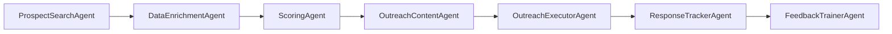

#  AI Agent Workflow - Outbound Lead Generation System


> **An intelligent, multi-agent workflow system that automates the entire outbound sales process—from lead discovery to performance optimization.**

---

##  Table of Contents

- [Overview](#overview)
- [Architecture](#architecture)
- [Features](#features)
- [Project Structure](#project-structure)
- [Prerequisites](#prerequisites)
- [Installation](#installation)
- [Configuration](#configuration)
- [Usage](#usage)
- [Workflow Steps](#workflow-steps)
- [Mock Mode](#mock-mode)
- [Extending the System](#extending-the-system)
- [Troubleshooting](#troubleshooting)
- [Demo Video](#demo-video)
- [License](#license)

---

##  Overview

This project implements an **end-to-end AI-powered sales automation system** using LangGraph that:

1. **Finds** potential customers matching your Ideal Customer Profile (ICP)
2. **Researches** them using enrichment APIs (Clearbit)
3. **Scores** and ranks leads based on fit and engagement potential
4. **Generates** personalized outreach emails using Google Gemini AI
5. **Sends** emails via SendGrid with delivery tracking
6. **Monitors** engagement (opens, clicks, replies)
7. **Learns** from results and suggests improvements

### Why This Matters

Manual prospecting takes **weeks**. This system does it in **hours**, with:
-  **Personalization at scale** (AI-generated emails)
-  **Data-driven decisions** (scoring and analytics)
-  **Continuous improvement** (feedback loop)
-  **Full traceability** (every action logged)

---

##  Architecture

### High-Level Flow

```
workflow.json → LangGraph Builder → 7 Agents → Tools (APIs) → Results
```

### Agent Pipeline



### Technology Stack

- **Orchestration**: LangGraph (stateful multi-agent workflows)
- **AI/LLM**: Google Gemini API (content generation)
- **Lead Discovery**: Clay API, Apollo.io API
- **Enrichment**: Clearbit API
- **Email**: SendGrid API
- **Tracking**: Google Sheets API
- **Validation**: Pydantic
- **Configuration**: YAML + .env

---

##  Features

### Core Capabilities

-  **Intelligent Lead Discovery**: Find companies matching complex ICP criteria
-  **Multi-Factor Scoring**: Rank leads using configurable weights
-  **AI Personalization**: Generate contextual emails using Gemini AI
-  **Email Automation**: Send at scale with rate limiting and error handling
-  **Engagement Tracking**: Monitor opens, clicks, replies, meetings
-  **Self-Improving**: AI analyzes performance and suggests optimizations
-  **Mock Mode**: Test without API keys or costs
-  **Resumable Workflows**: Checkpoint support via LangGraph
-  **Comprehensive Logging**: Every action tracked and logged

### Design Principles

1. **Modular**: Each agent is independent and testable
2. **Configurable**: Change behavior via JSON/YAML (no code changes)
3. **Observable**: Rich logging and metrics
4. **Resilient**: Automatic retries and error handling
5. **Cost-Efficient**: Mock mode prevents unnecessary API calls

---

##  Project Structure

```
AI_agent/
├── agents/                     # Agent implementations
│   ├── base_agent.py          # Abstract base class for all agents
│   ├── prospect_search_agent.py
│   ├── enrichment_agent.py
│   ├── scoring_agent.py
│   ├── outreach_content_agent.py
│   ├── outreach_executor_agent.py
│   ├── response_tracker_agent.py
│   └── feedback_trainer_agent.py
│
├── tools/                      # External API wrappers
│   ├── clay_api.py            # Company search
│   ├── apollo_api.py          # Contact search & email
│   ├── clearbit_api.py        # Data enrichment
│   ├── gemini_tool.py         # AI content generation
│   ├── sendgrid_tool.py       # Email sending
│   └── google_sheets_tool.py  # Recommendation tracking
│
├── utils/                      # Utilities
│   ├── logger.py              # Centralized logging
│   ├── config_loader.py       # Configuration management
│   └── json_validator.py      # Workflow validation
│
├── workflow.json               # Workflow definition (SINGLE SOURCE OF TRUTH)
├── config.yaml                 # Application configuration
├── langgraph_builder.py        # LangGraph workflow builder
├── run_workflow.py             # CLI execution tool
├── requirements.txt            # Python dependencies
├── .env.example               # Example environment variables
└── README.md                  # This file
```

---

##  Prerequisites

- **Python**: 3.8 or higher
- **API Keys** (optional, can use mock mode):
  - Google Gemini API Key
  - Clay API Key
  - Apollo.io API Key
  - Clearbit API Key
  - SendGrid API Key
  - Google Sheets credentials (JSON file)

---

##  Installation

### 1. Clone the Repository

```bash
git clone <your-repo-url>
cd AI_agent
```

### 2. Create Virtual Environment

```bash
python -m venv env
source env/bin/activate  # On Windows: env\Scripts\activate
```

### 3. Install Dependencies

```bash
pip install -r requirements.txt
```

### 4. Set Up Environment Variables

```bash
cp .env.example .env
```

Edit `.env` and add your API keys:

```bash
# .env file
GEMINI_API_KEY=your_gemini_api_key_here
CLAY_API_KEY=your_clay_api_key_here
APOLLO_API_KEY=your_apollo_api_key_here
CLEARBIT_API_KEY=your_clearbit_api_key_here
SENDGRID_API_KEY=your_sendgrid_api_key_here
SENDGRID_FROM_EMAIL=noreply@yourcompany.com
SENDGRID_FROM_NAME=Your Company

# Optional: Google Sheets
GOOGLE_SHEET_ID=your_sheet_id_here
GOOGLE_SHEETS_CREDENTIALS_FILE=credentials.json

# Workflow Settings
ENABLE_MOCK_MODE=true  # Set to false when using real APIs
DRY_RUN=false
MAX_LEADS_PER_RUN=100
LOG_LEVEL=INFO
```

### 5. Verify Installation

```bash
python -c "import langgraph; print('✓ LangGraph installed')"
python -c "import google.generativeai; print('✓ Gemini SDK installed')"
```

---

##  Configuration

### 1. workflow.json - The Workflow Blueprint

This file defines the entire workflow structure. **This is your single source of truth.**

**Key sections:**

```json
{
  "workflow_name": "OutboundLeadGeneration",
  "description": "End-to-end lead generation workflow",
  "steps": [
    {
      "id": "prospect_search",
      "agent": "ProspectSearchAgent",
      "inputs": {
        "icp": {
          "industry": ["SaaS", "Technology"],
          "employee_count": {"min": 100, "max": 1000}
        }
      },
      "instructions": "Search for companies matching ICP",
      "tools": [
        {"name": "ClayAPI", "config": {...}},
        {"name": "ApolloAPI", "config": {...}}
      ],
      "output_schema": {...}
    },
    // ... more steps
  ]
}
```

**To modify workflow:**
- Add/remove steps
- Change agent order
- Adjust ICP criteria
- Modify tool configurations

### 2. config.yaml - Application Settings

Configure ICP, scoring weights, campaign settings, etc.

**Key sections:**

```yaml
# Ideal Customer Profile
icp:
  industry: [SaaS, Technology, FinTech]
  location: [USA, UK, Canada]
  employee_count:
    min: 100
    max: 1000
  revenue:
    min: 20000000
    max: 200000000

# Scoring weights (must sum to ~1.0)
scoring:
  weights:
    industry_match: 0.25
    company_size: 0.20
    revenue_range: 0.20
    growth_signals: 0.25
    technology_stack: 0.10
  min_score_threshold: 0.60

# Outreach settings
outreach:
  persona: "SDR"
  tone: "friendly_professional"
  value_proposition: "AI-powered workflow automation"

# Campaign settings
campaign:
  batch_size: 50
  daily_send_limit: 100
  time_between_sends: 300  # milliseconds
```

---

##  Usage

### Quick Start (Mock Mode)

Run the workflow with mock data (no API keys needed):

```bash
python run_workflow.py
```

This will:
1. Load `workflow.json`
2. Execute all 7 steps with mock data
3. Save results to `data/run_output_TIMESTAMP.json`

### Production Mode (Real APIs)

1. **Set environment variables** in `.env`
2. **Disable mock mode**:
   ```bash
   ENABLE_MOCK_MODE=false
   ```
3. **Run workflow**:
   ```bash
   python run_workflow.py
   ```

### Advanced Usage

```bash
# Use custom workflow file
python run_workflow.py --workflow custom_workflow.json

# Limit to 50 leads (cost control)
python run_workflow.py --max-leads 50

# Don't save results
python run_workflow.py --no-save

# View workflow info
python langgraph_builder.py --info

# Visualize workflow graph
python langgraph_builder.py --visualize
```

### Using as a Module

```python
from langgraph_builder import LangGraphWorkflowBuilder

# Initialize
builder = LangGraphWorkflowBuilder("workflow.json")

# Execute
final_state = builder.execute()

# Access results
leads = final_state["prospect_search"]["leads"]
recommendations = final_state["feedback_trainer"]["recommendations"]
```

---

## Workflow Steps

### Step 1: ProspectSearchAgent

**Purpose**: Find companies matching ICP

**Tools**: Clay API, Apollo API

**Input**:
```json
{
  "icp": {
    "industry": ["SaaS"],
    "employee_count": {"min": 100, "max": 500}
  }
}
```

**Output**:
```json
{
  "leads": [
    {
      "company": "Acme Corp",
      "contact_name": "John Smith",
      "email": "john@acme.com",
      "company_size": 250
    }
  ],
  "total_found": 127
}
```

---

### Step 2: DataEnrichmentAgent

**Purpose**: Add detailed company/person data

**Tools**: Clearbit API

**Input**: Leads from Step 1

**Output**: Enriched leads with technologies, social profiles, recent news

---

### Step 3: ScoringAgent

**Purpose**: Rank leads by quality

**Input**: Enriched leads

**Output**:
```json
{
  "ranked_leads": [
    {
      "lead": {...},
      "score": 0.87,
      "rank": 1,
      "score_breakdown": {
        "icp_fit": 0.95,
        "growth_signals": 1.0,
        "engagement_potential": 0.8
      }
    }
  ]
}
```

---

### Step 4: OutreachContentAgent

**Purpose**: Generate personalized emails

**Tools**: Google Gemini AI

**Input**: Top-ranked leads

**Output**:
```json
{
  "messages": [
    {
      "lead_email": "john@acme.com",
      "subject_line": "Congrats on Acme's Series B!",
      "email_body": "Hi John, ...",
      "personalization_score": 0.85
    }
  ]
}
```

---

### Step 5: OutreachExecutorAgent

**Purpose**: Send emails

**Tools**: SendGrid API

**Input**: Generated messages

**Output**:
```json
{
  "campaign_id": "camp_20241020_143000",
  "total_sent": 48,
  "total_failed": 2,
  "sent_status": [...]
}
```

---

### Step 6: ResponseTrackerAgent

**Purpose**: Monitor engagement

**Tools**: Apollo API

**Input**: Campaign ID

**Output**:
```json
{
  "metrics": {
    "open_rate": 0.52,
    "click_rate": 0.18,
    "reply_rate": 0.08
  },
  "hot_lead_count": 5,
  "warm_lead_count": 15
}
```

---

### Step 7: FeedbackTrainerAgent

**Purpose**: Analyze & suggest improvements

**Tools**: Google Sheets, Gemini AI

**Input**: Campaign metrics

**Output**:
```json
{
  "recommendations": [
    {
      "category": "subject_line",
      "recommendation": "Test more specific subject lines",
      "expected_impact": "15% increase in open rate",
      "priority": "high"
    }
  ],
  "approval_status": "pending"
}
```

---

##  Mock Mode

**Mock mode** allows testing without API keys or costs.

### How It Works

Each tool checks if it has an API key:

```python
class ClayAPI:
    def __init__(self, api_key=None, mock_mode=False):
        self.api_key = api_key
        self.mock_mode = mock_mode or not self.api_key
        
        if self.mock_mode:
            logger.info("🎭 Running in MOCK MODE")
```

If no API key → automatically use mock mode.

### Mock Data Features

-  **Realistic data**: Mock companies, contacts, engagement metrics
-  **Consistent**: Same input → same output
-  **Configurable**: Adjust mock data in tool files
-  **Simulates failures**: 10% mock failure rate in SendGrid

### Enable/Disable Mock Mode

```bash
# In .env
ENABLE_MOCK_MODE=true   # Mock mode ON
ENABLE_MOCK_MODE=false  # Mock mode OFF (uses real APIs)
```

### Current Status

 **This project is currently running in MOCK MODE** (no API keys configured)

To use real APIs:
1. Add API keys to `.env`
2. Set `ENABLE_MOCK_MODE=false`
3. Run workflow

---

##  Extending the System

### Adding a New Agent

1. **Create agent file**: `agents/my_new_agent.py`

```python
from agents.base_agent import BaseAgent

class MyNewAgent(BaseAgent):
    def _initialize(self):
        # Setup
        pass
    
    def _validate_input(self, input_data):
        # Validate
        return True
    
    def _execute(self, input_data):
        # Main logic
        return {"result": "data"}
```

2. **Add to workflow.json**:

```json
{
  "id": "my_new_step",
  "agent": "MyNewAgent",
  "inputs": {...},
  "instructions": "Do something",
  "tools": [],
  "output_schema": {...}
}
```

3. **Register in builder**:

```python
# langgraph_builder.py
from agents.my_new_agent import MyNewAgent

self.agents = {
    # ... existing agents
    "MyNewAgent": MyNewAgent(agent_id="my_new")
}
```

### Adding a New Tool

1. **Create tool file**: `tools/my_api.py`

```python
class MyAPI:
    def __init__(self, api_key=None, mock_mode=False):
        self.api_key = api_key
        self.mock_mode = mock_mode or not self.api_key
    
    def my_method(self, data):
        if self.mock_mode:
            return self._mock_my_method(data)
        
        # Real API call
        response = requests.post(...)
        return response.json()
    
    def _mock_my_method(self, data):
        return {"mock": "data"}
```

2. **Use in agent**:

```python
from tools.my_api import MyAPI

class MyAgent(BaseAgent):
    def _initialize(self):
        self.my_api = MyAPI()
```

### Modifying Scoring Logic

Edit `agents/scoring_agent.py`:

```python
def _score_icp_fit(self, lead):
    score = 0.0
    
    # Add your custom scoring logic
    if lead.get('custom_field') == 'desired_value':
        score += 0.5
    
    return score
```

Then adjust weights in `config.yaml`:

```yaml
scoring:
  weights:
    icp_fit: 0.30
    custom_score: 0.20  # Add new weight
```

---

## 🐛 Troubleshooting

### Common Issues

#### 1. Import Errors

```
ModuleNotFoundError: No module named 'langgraph'
```

**Solution**:
```bash
pip install -r requirements.txt
```

#### 2. API Key Not Found

```
⚠ GEMINI_API_KEY not found, using mock mode
```

**Solution**: Add API key to `.env` file

#### 3. Workflow Validation Failed

```
ValidationError: Step 'enrichment' references non-existent step
```

**Solution**: Check `workflow.json` for typos in step IDs

#### 4. Google Sheets Authentication Failed

```
Failed to initialize Google Sheets: credentials.json not found
```

**Solution**:
1. Create Google Cloud project
2. Enable Google Sheets API
3. Download credentials JSON
4. Save as `credentials.json` in project root

### Debug Mode

Enable detailed logging:

```bash
# In .env
LOG_LEVEL=DEBUG
```

View logs:
```bash
tail -f logs/workflow_YYYYMMDD.log
```

### Getting Help

- Check logs in `logs/` directory
- Review `workflow.json` for syntax errors
- Verify API keys in `.env`
- Run with `--max-leads 5` for faster testing

---

##  Demo Video

[**Watch the 5-minute walkthrough**](link-to-your-video)

**What's covered:**
- System architecture overview
- Step-by-step workflow execution
- Mock mode demonstration
- Key design decisions
- Extension points

---

## Performance Metrics

| Metric | Manual Process | AI Agent System |
|--------|---------------|-----------------|
| Lead Discovery | 2-3 hours | 2-3 minutes |
| Data Enrichment | 1 hour | 5 minutes |
| Email Writing | 30 min per email | 10 emails/minute |
| Tracking | Manual spreadsheets | Automatic |
| Optimization | Ad-hoc | Continuous AI analysis |

---

## Security Notes

-  **Never commit `.env` file** to version control
-  API keys should be kept secret
-  Use environment variables for all sensitive data
-  Review generated emails before sending (especially in production)
-  Implement rate limiting to avoid spam detection

---

##  Roadmap

- [ ] Add email A/B testing
- [ ] Implement multi-channel outreach (LinkedIn, Twitter)
- [ ] Add CRM integration (Salesforce, HubSpot)
- [ ] Build web UI for workflow management
- [ ] Add webhook support for real-time notifications
- [ ] Implement human-in-the-loop approval workflow

---

##  Contributing

Contributions welcome! Please:

1. Fork the repository
2. Create a feature branch
3. Add tests for new functionality
4. Submit a pull request

---

##  License

MIT License - see LICENSE file for details

---

##  Acknowledgments

- **LangGraph** - Stateful agent orchestration
- **Google Gemini** - AI content generation
- **Pydantic** - Data validation
- **ColorLog** - Beautiful logging

---

##  Contact

For questions or support, please open an issue on GitHub.

---
